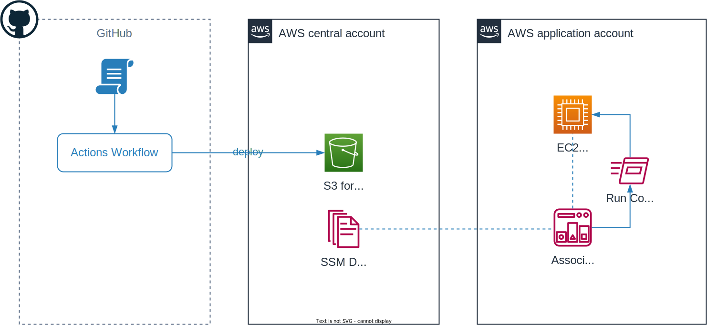

## AWS aSSMble

This project is supposed to simplify use of SSM with own scripts.

## Overview

The diagram below visualizes the general concept:

Scripts from a specific repository are uploaded to S3 bucket and later used/executed via a SSM Document.

## IaC

Required resources can be applied via Terraform.
The Terraform module can be found in `terraform/modules/central`.
